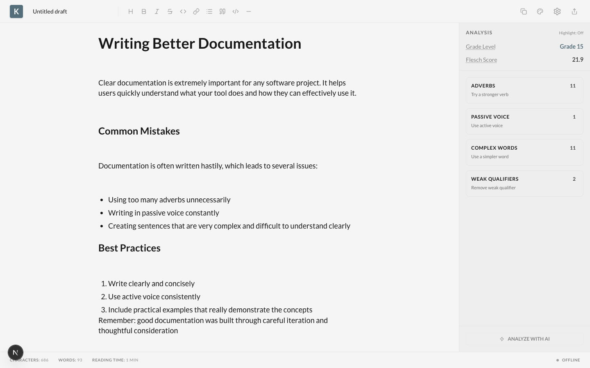

# Kitaab

[](LICENSE)
[](https://nextjs.org/)
[](https://www.typescriptlang.org/)
[](https://chandanmahapatra.github.io/kitaab/)

> A privacy-first, local-first markdown editor with real-time writing analysis and AI-powered evaluation.



## Overview

Kitaab is a modern markdown editor that helps you write better, clearer content. Unlike cloud-based editors, all your data stays on your device. Writing analysis runs locally in your browser with no server required, and AI integrations are optional and transparent about costs.

Whether you're writing technical documentation, blog posts, or creative content, Kitaab provides real-time feedback on readability, identifies common writing issues, and helps you craft clearer, more engaging text—all while keeping your work completely private.

## Key Features

### Core Editing
- **Markdown-first editing** with live preview using Lexical editor
- **Rich formatting** support: headings, lists, code blocks, links, bold, italic, strikethrough
- **Multiple themes**: Light, Dark, Sepia, Grey for comfortable writing in any environment
- **Auto-save** with client-side storage (IndexedDB)
- **Export options**: Markdown (.md), HTML, PDF with professional formatting

### Real-Time Writing Analysis (100% Local)
- **Readability scores**:
  - Flesch Reading Ease (0-100 scale)
  - Coleman-Liau Grade Level
- **Writing quality score** (0-100) based on clarity best practices
- **Issue detection** with visual highlighting:
  - Adverbs (words ending in -ly)
  - Passive voice constructions
  - Complex sentences (>25 words)
  - Hard words (3+ syllables)
  - Weak qualifiers ("I think", "maybe", etc.)
- **Reading statistics**: character count, word count, reading time estimation

### AI-Powered Evaluation (Optional)
- **Multiple AI providers**: OpenAI, Anthropic, OpenRouter
- **Grammar and clarity scoring** from state-of-the-art language models
- **Actionable suggestions** for improvement
- **Cost transparency**: Real-time token usage and cost estimation
- **Privacy-first**: API keys stored locally in IndexedDB, direct API calls (no proxy server)

### Privacy & Security
- **Local-first**: All documents stored in your browser (IndexedDB)
- **No server required**: Analysis algorithms run client-side in JavaScript
- **API keys never leave your device**: Stored in IndexedDB, never transmitted to our servers (we don't have any!)
- **Static deployment**: No backend, no database, no user tracking
- **Open source**: Full transparency—audit the code yourself

## Screenshots


*Real-time writing analysis with issue detection and readability metrics*

## Tech Stack

- **Framework**: Next.js 16.1.6 with Static Export
- **UI Library**: React 19, TypeScript 5
- **Editor**: Lexical (Meta's extensible text editor framework) with markdown support
- **Styling**: Tailwind CSS 4
- **UI Components**: Radix UI, Base UI, Lucide React icons
- **AI SDK**: Vercel AI SDK with OpenAI and Anthropic providers
- **Storage**: IndexedDB via `idb` wrapper
- **Export**: jsPDF, html2pdf.js, markdown-it

## Getting Started

### Prerequisites

- Node.js 20+ and npm

### Installation

1. **Clone the repository:**
   ```bash
   git clone https://github.com/ChandanMahapatra/kitaab.git
   cd kitaab
   ```

2. **Install dependencies:**
   ```bash
   npm install
   ```

3. **Run the development server:**
   ```bash
   npm run dev
   ```

4. **Open your browser:**
   Navigate to [http://localhost:3000](http://localhost:3000)

### Production Build

Build the static export for deployment:

```bash
npm run build
```

The optimized static files will be generated in the `out/` directory and can be deployed to any static hosting service.

## Deployment

Kitaab is optimized for static hosting and deploys seamlessly to GitHub Pages with automated CI/CD.

**Live Demo**: [https://chandanmahapatra.github.io/kitaab/](https://chandanmahapatra.github.io/kitaab/)

### Deploy to GitHub Pages

1. Fork this repository
2. Enable GitHub Pages in **Settings → Pages**
3. Set source to **"Deploy from a branch"** → `gh-pages` branch
4. Push to `main` branch—the automated GitHub Actions workflow handles the build and deployment!

For detailed deployment instructions, troubleshooting, and configuration options, see [DEPLOY.md](./DEPLOY.md).

## Configuration

### AI Provider Setup (Optional)

Kitaab's AI features are completely optional. To enable AI-powered evaluation:

1. Click the **Settings** icon (⚙️) in the header
2. Choose your AI provider:
   - **OpenAI**: GPT-4, GPT-3.5-turbo
   - **Anthropic**: Claude 3 Opus, Sonnet, Haiku
   - **OpenRouter**: Access to multiple models (Claude, GPT, Gemini, etc.)
3. Enter your API key and select a model
4. Test the connection
5. Click **"Save Settings"**

**Privacy Note**: Your API key is stored locally in your browser's IndexedDB and is never transmitted except directly to your chosen AI provider. No intermediary servers are involved.

### Supported AI Models

| Provider | Models |
|----------|--------|
| **OpenAI** | gpt-4, gpt-4-turbo, gpt-3.5-turbo |
| **Anthropic** | claude-3-opus, claude-3-sonnet, claude-3-haiku |
| **OpenRouter** | claude-3.5-sonnet, gpt-4o, gemini-pro-1.5, and 100+ more |

## Usage Tips

- **Markdown shortcuts**: Type `#` for headings, `*` for lists, ` ``` ` for code blocks
- **Hover highlighting**: Hover over issue types in the sidebar to highlight them in the editor
- **Keyboard formatting**: Use the toolbar or standard keyboard shortcuts for bold, italic, strikethrough
- **Export anywhere**: Copy formatted text to clipboard or download as MD/HTML/PDF
- **Cost tracking**: Enable cost estimates in AI settings to monitor usage and expenses
- **Theme switching**: Toggle between light, dark, sepia, and grey themes for comfortable writing

## Architecture

Kitaab is built with privacy and simplicity as core principles:

- **Client-side only**: All text processing, analysis, and storage happens in your browser
- **No backend**: Static files served via CDN—no server infrastructure to maintain
- **No tracking**: No analytics, no telemetry, no cookies, no user accounts
- **Offline-capable**: Core editing and analysis work without internet (AI features require connection)

For implementation details and analysis algorithms, see [logic.md](./logic.md).

## Privacy Philosophy

Privacy isn't a feature—it's the foundation of Kitaab:

- **Your writing never leaves your device** unless you explicitly export or use AI features
- **No data collection**: We don't collect, store, or transmit any user data
- **No user accounts**: No sign-up, no passwords, no user tracking
- **No cloud sync**: Your documents stay in your browser's local storage
- **AI is optional**: Use local analysis without ever connecting to external services
- **Transparent AI costs**: When you do use AI, you see exactly what it costs

Unlike cloud-based writing tools that monetize your data or charge subscription fees for basic features, Kitaab gives you professional-grade writing analysis for free, with complete control over your content.

## Contributing

Contributions are welcome! Whether it's bug reports, feature requests, or code contributions, we appreciate your help in making Kitaab better.

### How to Contribute

1. **Fork the repository**
2. **Create a feature branch**: `git checkout -b feature/AmazingFeature`
3. **Make your changes** with clear, descriptive commits
4. **Test your changes** thoroughly
5. **Push to your branch**: `git push origin feature/AmazingFeature`
6. **Open a Pull Request** with a clear description of your changes

### Code Structure

```
src/
├── app/                    # Next.js app directory
│   ├── page.tsx            # Main page component
│   ├── layout.tsx          # Root layout
│   └── globals.css         # Global styles
├── components/
│   ├── KitaabApp.tsx       # Main application orchestrator
│   ├── editor/             # Lexical editor components and plugins
│   ├── layout/             # Header, sidebar, layout components
│   ├── settings/           # Settings modal and configuration
│   └── ui/                 # Reusable UI components
├── lib/
│   ├── analysis.ts         # Core writing analysis algorithms
│   ├── ai.ts               # AI provider integration
│   ├── export.ts           # Export functionality (MD, HTML, PDF)
│   ├── storage.ts          # IndexedDB operations
│   └── pricing.ts          # AI model pricing and cost calculation
└── hooks/                  # Custom React hooks
```

### Development Guidelines

- Follow the existing code style (TypeScript, functional components)
- Write meaningful commit messages
- Add tests for new features when applicable
- Update documentation for user-facing changes
- Ensure the build passes: `npm run build`

## Roadmap

Future enhancements we're considering:

- [ ] **Collaborative editing** (peer-to-peer, no server)
- [ ] **Local LLM support** (Ollama, LM Studio integration)
- [ ] **Custom analysis rules** (create your own writing style checks)
- [ ] **Browser extension** (analyze text on any webpage)
- [ ] **Mobile app** (React Native)
- [ ] **Multiple document management**
- [ ] **Import from other formats** (DOCX, RTF)
- [ ] **Grammar checking** (local, rules-based)

## License

MIT License - see [LICENSE](./LICENSE) for details.

Copyright (c) 2026 Chandan Mahapatra

## Acknowledgments

- Built with [Next.js](https://nextjs.org/) and [Lexical](https://lexical.dev/)
- Inspired by Hemingway Editor and Grammarly
- Analysis algorithms based on established readability research (Flesch-Kincaid, Coleman-Liau)
- Design principles influenced by modern minimalist text editors

## Support

- **Report issues**: [GitHub Issues](https://github.com/ChandanMahapatra/kitaab/issues)
- **Feature requests**: [GitHub Discussions](https://github.com/ChandanMahapatra/kitaab/discussions)
- **Questions**: [GitHub Discussions Q&A](https://github.com/ChandanMahapatra/kitaab/discussions/categories/q-a)

---

**Built with privacy in mind. Your words, your device, your control.**
